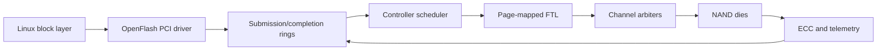

# OpenFlash Controller Lab

OpenFlash is an executable architecture lab for designing a high-throughput NAND flash
controller and its Linux software stack. It starts with the parts that most strongly
determine performance: channel/die parallelism, queue scheduling, logical-to-physical
placement, tail latency, and a clean host/controller contract.

This is an engineering prototype, not a production SSD firmware or a complete NAND
driver. The simulator is runnable today; the kernel module defines the integration
surface that will be connected to emulated hardware in the next milestone.

## What is implemented

- Discrete-event NAND timing model with shared channels and independent dies.
- Page-mapped FTL with deterministic channel/die striping and invalidation tracking.
- FIFO and bounded read-priority schedulers.
- Reproducible synthetic mixed read/write workloads.
- Throughput, IOPS, utilization, and p50/p95/p99 latency reporting.
- Linux PCI driver scaffold with DMA mask negotiation, queue contracts, and lifecycle.
- Unit tests, linting, CI, fio profiles, architecture notes, and milestone gates.

## Architecture



The intended managed-device path uses `blk-mq` on the host and keeps FTL, ECC,
wear-leveling, and bad-block policy in controller firmware. A raw-NAND MTD variant is
possible, but it is a different product boundary and should not share the same ABI.

## Quick start

```bash
python -m venv .venv
python -m pip install -e ".[dev]"
python -m pytest -q
python -m openflash.cli compare --requests 10000
```

Example output:

```text
fifo              ... MiB/s  ... IOPS  p99=... us  read-p99=... us
read-priority     ... MiB/s  ... IOPS  p99=... us  read-p99=... us
```

Use JSON output for scripts:

```bash
python -m openflash.cli run --policy read-priority --requests 50000 --json
```

## Concrete implementation sequence

1. **Simulator and policy baseline (current milestone).** Validate resource timing,
   placement, scheduler behavior, reproducibility, and performance metrics. Exit gate:
   tests pass and policy comparisons produce stable JSON results.
2. **Emulated controller and Linux data path.** Implement a QEMU PCI device exposing
   versioned admin and I/O queues, then complete the driver's `blk-mq`, DMA, IRQ, timeout,
   and reset paths. Exit gate: mount a filesystem, survive reset/fault tests, and run fio.
3. **Firmware/RTL and NAND subsystem optimization.** Port scheduler/FTL policies into
   firmware, add ECC and GC, then map queue/channel engines to FPGA RTL. Exit gate:
   sustained bandwidth, bounded p99 latency, recovery correctness, and endurance targets.

See [Architecture](docs/ARCHITECTURE.md), [implementation roadmap](docs/ROADMAP.md), and
[Linux driver notes](driver/openflash/README.md) for detailed acceptance criteria.

## Safety and scope

Do not load the scaffold against arbitrary hardware. Register offsets and the queue ABI
are provisional. Real NAND work must add power-loss protection, bad-block handling,
wear-leveling, ECC characterization, secure firmware update, and exhaustive fault tests.

## License

Apache-2.0.
