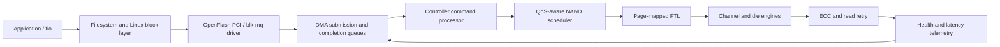

# OpenFlash Controller Lab

[](https://github.com/manishklach/openflash-controller-lab/actions/workflows/ci.yml)
[](https://github.com/manishklach/openflash-controller-lab/releases)
[](pyproject.toml)
[](#licensing)

OpenFlash is an executable architecture and systems laboratory for building a fast NAND
flash controller together with its Linux host stack. It connects controller scheduling,
flash translation, media behavior, a binary queue ABI, emulated PCI hardware, and a Linux
driver in one repository so performance ideas can be measured before they become RTL.

The project is deliberately honest about maturity. The simulator, behavioral controller,
and queue transport run today. The Linux module compiles and initializes an admin queue.
The QEMU source implements the first MMIO/DMA path but still needs to be pinned, integrated,
and tested against a specific upstream QEMU revision. OpenFlash is not yet suitable for
storing valuable data or loading against unverified hardware.

## Why OpenFlash exists

NAND media operations are slow relative to PCIe and CPU execution, but a controller can
hide much of that latency by keeping independent channels and dies busy. That only works
when every layer cooperates:

- the FTL must place data across independent resources without creating pathological GC;
- the scheduler must exploit parallelism while bounding read and write starvation;
- the queue transport must avoid global serialization and stale completion races;
- ECC, retry, wear, and background work must be included in tail-latency measurements;
- the Linux driver must submit asynchronously and recover safely from timeouts and reset;
- firmware and RTL must preserve the behavior already validated in software.

OpenFlash turns those requirements into executable models, shared ABI definitions, tests,
and measurable exit gates.

## Current status

| Area | Status | What works now | Next gate |
| --- | --- | --- | --- |
| NAND simulator | Runnable | Channels, dies, timing distributions, ECC retry, wear, GC | Calibrate against a real NAND part |
| FTL | Runnable model | Page mapping, striping, invalidation, live-page relocation | Journaling, recovery, over-provisioning |
| Scheduler | Runnable model | FIFO and starvation-bounded read priority | Per-channel ready queues and deadlines |
| ABI | Versioned v0.1 | 64-byte command/completion layout and durability rules | Identify payload and multi-queue negotiation |
| Reference device | Runnable | Read/write/flush/FUA/discard, faults, power loss | Queue timeout and reset replay policies |
| Queue engine | Runnable | SQ/CQ wraparound, phase tags, batching, interrupts | Multiple queues and interrupt coalescing |
| QEMU device | CI build pinned | QEMU 11.0.2, BAR0, DMA, MSI-X, RAM-backed I/O | QTests and persistent backing |
| Linux driver | Module builds | PCI/admin rings, MSI-X, identify capacity | Generic completion drain and `blk-mq` disk |
| Firmware/RTL | Planned | Requirements derived from the executable model | Channel-engine testbench and firmware scheduler |

## System architecture



The primary architecture is a managed block device: FTL, ECC, wear-leveling, and
bad-block policy live behind the controller ABI, while Linux uses `blk-mq`. A raw-NAND
MTD/UBI/UBIFS design remains possible, but it is a separate product boundary and should
not share this managed-device ABI.

## Implemented components

### NAND and FTL simulator

The discrete-event model tracks shared channel transfer time and independent die media
time. Workloads can vary channel count, dies per channel, queue depth, read/write ratio,
arrival rate, geometry, and latency parameters. Results include:

- throughput and IOPS;
- mean and p50/p95/p99 latency;
- read and write p99 latency;
- channel utilization;
- GC events and relocated pages;
- write amplification and maximum erase count;
- corrected bits, read retries, and uncorrectable reads.

Media latency is sampled from a seeded log-normal distribution. ECC pressure increases
with block wear, and read retry consumes additional media time. The implementation is
reproducible for a fixed configuration and seed.

### Flash translation layer

The current FTL uses full page mapping and stripes allocations across channels and dies.
Overwrites invalidate old physical pages. When free space crosses the configured
watermark, GC chooses a victim, relocates its live pages, erases it, and returns its pages
to the allocator. Erase counts and relocation cost feed simulator telemetry.

This is a policy model, not production firmware. Persistent mapping journals,
checkpoint/replay, bad-block retirement, static/dynamic wear leveling, TRIM, and atomic
metadata updates remain required.

### Scheduler

Two policies provide a controlled baseline:

- `fifo` preserves arrival and request order;
- `read-priority` serves bounded read bursts, then admits waiting writes to prevent
  starvation.

The next scheduler revision will use per-channel ready queues, request aging, deadlines,
multi-plane eligibility, GC throttling, and explicit QoS classes.

### Host/controller ABI v0.1

The ABI defines fixed 64-byte little-endian commands and completions, BAR0 lifecycle and
queue registers, feature negotiation, status codes, phase-tagged ring ownership, and
flush/FUA durability semantics. Normative definitions are in
[`driver/openflash/openflash_abi.h`](driver/openflash/openflash_abi.h); the Python and QEMU
implementations are checked against them in CI.

### Reference controller and queues

The Python reference device is an executable behavioral oracle for future QEMU, firmware,
and RTL implementations. It validates DMA ranges and LBAs, supports identify/read/write/
flush/FUA/discard, distinguishes volatile from durable data, simulates power loss, and
injects controller faults. The queue engine adds SQ/CQ ownership, queue-full backpressure,
phase-bit wraparound, interrupt batching, and reset cleanup.

### QEMU PCI device

[`qemu/hw/block/openflash.c`](qemu/hw/block/openflash.c) implements an initial in-tree QEMU
PCI model with BAR0 register handling, guest DMA, one queue, one MSI-X vector, reset, and
RAM-backed block operations. QEMU internal APIs are not a stable external plugin ABI, so
the source must be compiled against a pinned revision before it is considered validated.
See [`qemu/README.md`](qemu/README.md) for the integration procedure and remaining QTests.

### Linux driver

The GPL-2.0-only driver currently:

- binds to the experimental `1d1d:f15a` PCI ID;
- enables PCI memory and 64-bit coherent DMA;
- maps BAR0 and validates ABI v0.1;
- allocates coherent admin submission/completion rings;
- configures one MSI-X vector and interrupt handler;
- publishes ring addresses, enables the controller, and polls readiness;
- tears down IRQ, DMA, queue, and PCI ownership in a safe order.

It intentionally does not register a disk yet. Identify completion, I/O queue creation,
timeout/reset semantics, and data verification must land before exposing a block device.

## Quick start

### Requirements

- Python 3.10 or newer;
- `pip` and a virtual environment implementation;
- `make` for convenience targets;
- optional: Linux kernel headers for the module build;
- optional: a QEMU source checkout for device integration.

### Install and validate

```bash
git clone https://github.com/manishklach/openflash-controller-lab.git
cd openflash-controller-lab
python -m venv .venv
source .venv/bin/activate
python -m pip install -e ".[dev]"
python -m ruff check src tests
python -m pytest -q
```

PowerShell activation uses `.venv\Scripts\Activate.ps1` instead of the `source` command.

### Compare scheduler policies

```bash
python -m openflash.cli compare \
  --requests 10000 \
  --read-ratio 0.70 \
  --working-set-pages 65536 \
  --arrival-rate 0.5 \
  --channels 8 \
  --dies-per-channel 4 \
  --seed 7
```

Illustrative output from the default seeded model:

```text
fifo               644.5 MiB/s       41249 IOPS  p99=211871.6 us  read-p99=211446.0 us
read-priority      817.6 MiB/s       52328 IOPS  p99=167508.5 us  read-p99=112902.8 us
```

These are model results, not hardware benchmarks. They demonstrate policy comparison and
must not be presented as product performance.

### Run one policy and emit JSON

```bash
python -m openflash.cli run \
  --policy read-priority \
  --requests 50000 \
  --channels 8 \
  --dies-per-channel 4 \
  --seed 42 \
  --json
```

### Replay a trace

```bash
python -m openflash.cli replay examples/mixed-trace.jsonl \
  --policy read-priority \
  --json
```

Each non-comment JSONL record accepts:

```json
{"request_id": 7, "operation": "write", "lpn": 1024, "pages": 1, "arrival_us": 12.5}
```

`request_id`, `pages`, and `arrival_us` have defaults; `operation` and `lpn` are required.

## CLI reference

| Command | Purpose |
| --- | --- |
| `openflash-sim run` | Generate one synthetic workload and run one policy |
| `openflash-sim compare` | Run FIFO and read-priority on the same seeded workload |
| `openflash-sim replay TRACE` | Replay a JSONL request trace |
| `--json` | Emit machine-readable results |
| `--seed N` | Reproduce workload and media randomness |
| `--channels N` | Configure independent NAND channels |
| `--dies-per-channel N` | Configure die-level parallelism |

The installed `openflash-sim` entry point and `python -m openflash.cli` are equivalent.

## Building the Linux module

With headers for the running kernel installed:

```bash
make -C /lib/modules/$(uname -r)/build \
  M="$PWD/driver/openflash" \
  CONFIG_OPENFLASH=m \
  modules
modinfo driver/openflash/openflash.ko
make -C /lib/modules/$(uname -r)/build \
  M="$PWD/driver/openflash" \
  clean
```

Do not load the module unless a matching OpenFlash QEMU device or controlled experimental
device is present. The PCI ID and ABI are provisional.

## Benchmark strategy

The `bench/fio` profiles cover mixed random latency and sequential bandwidth. They target
`/dev/openflash0`, which will not exist until the `blk-mq` milestone. When enabled, every
performance run should also report:

- device geometry, firmware/ABI revision, PCIe link, and NAND timing profile;
- workload seed, queue depth, job count, block size, read ratio, and runtime;
- throughput, IOPS, p50/p95/p99/p99.9, CPU/request, and interrupt rate;
- write amplification, GC duty cycle, free-block watermark, and channel utilization;
- ECC retries, corrected-bit distribution, uncorrectable errors, and wear state;
- whether data verification, flush/FUA, and fault injection were enabled.

A throughput improvement that violates durability or the selected latency gate is a
regression.

## Repository layout

```text
src/openflash/              Simulator, FTL, ABI, device, queue, and CLI
tests/                      Unit, durability, queue, and ABI consistency tests
driver/openflash/           GPL Linux PCI driver and normative ABI header
qemu/hw/block/              Initial in-tree QEMU PCI device source
bench/fio/                  fio correctness and performance profiles
examples/                   Reproducible JSONL traces
docs/                       Architecture, ABI, and implementation roadmap
.github/workflows/          Continuous integration
```

## Roadmap and exit gates

### 1. Model and policy baseline

Implemented. The model is deterministic under a seed and exercises FTL placement, GC,
wear, ECC, scheduling, and queue policy. The remaining gate is calibration against a real
NAND part or a trusted device trace.

### 2. Emulated controller and Linux data path

In progress. The immediate sequence is:

1. Pin and compile the QEMU model; add QTests for MMIO, DMA, wraparound, malformed commands,
   reset, and MSI-X.
2. Submit identify through the Linux admin ring and drain phase-tagged completions.
3. Negotiate multiple I/O queues and map MSI-X vectors to queue-local completion handling.
4. Register a `blk-mq` disk with read/write/flush/FUA/discard and timeout/reset behavior.
5. Run fio verification and fault injection before persistent image backing is enabled.

### 3. Firmware, RTL, and NAND subsystem

Planned. Validated scheduler/FTL behavior will move into firmware, followed by ONFI channel
engines, ECC pipelines, persistent metadata recovery, FPGA tests, thermal controls, secure
firmware update, and power-cut qualification.

Detailed deliverables and quantitative gates are maintained in
[`docs/ROADMAP.md`](docs/ROADMAP.md).

## Known limitations

- Default NAND timing and error parameters are hypotheses, not characterized silicon data.
- GC media cost is conservatively charged but not yet scheduled per die.
- The FTL mapping is volatile and has no recovery journal.
- QEMU currently has one queue and volatile RAM backing.
- The QEMU build is pinned to 11.0.2; device QTests are not implemented yet.
- The Linux interrupt handler does not yet drain completions.
- No block disk is registered, so fio profiles are future acceptance tests.
- There is no secure firmware/update path, power-loss protection model, or bad-block table.

## Contributing

Keep changes measurable and scoped. Add focused tests for queue ownership, durability,
error handling, and resource constraints. Performance changes should include the exact
configuration and seed used for comparison. Kernel changes must build as a module and pass
`checkpatch.pl`; ABI changes must update the C, Python, QEMU, documentation, and consistency
tests together.

Please avoid presenting simulator output as hardware performance. Open issues or pull
requests with a clear workload, expected invariant, and validation method.

## Security and data safety

OpenFlash processes DMA addresses supplied through an experimental ABI. Treat the QEMU
device and driver as privileged systems code. Do not expose them to untrusted guests or
load the driver against arbitrary PCI hardware. Real deployment requires DMA/IOMMU threat
analysis, descriptor validation, firmware authentication, rollback protection, metadata
integrity, and exhaustive reset/power-failure testing.

## Documentation

- [`docs/ARCHITECTURE.md`](docs/ARCHITECTURE.md): controller and subsystem design.
- [`docs/ABI.md`](docs/ABI.md): host/controller ABI and durability rules.
- [`docs/ROADMAP.md`](docs/ROADMAP.md): implementation tasks and acceptance gates.
- [`driver/openflash/README.md`](driver/openflash/README.md): Linux driver lifecycle.
- [`qemu/README.md`](qemu/README.md): QEMU integration and test requirements.
- [`CHANGELOG.md`](CHANGELOG.md): release history.

## Licensing

The simulator, tools, documentation, and QEMU model are licensed under Apache-2.0. The
Linux kernel driver subtree is GPL-2.0-only because it uses required GPL-only kernel
interfaces. See [`LICENSE`](LICENSE) and [`driver/openflash/LICENSE`](driver/openflash/LICENSE).
